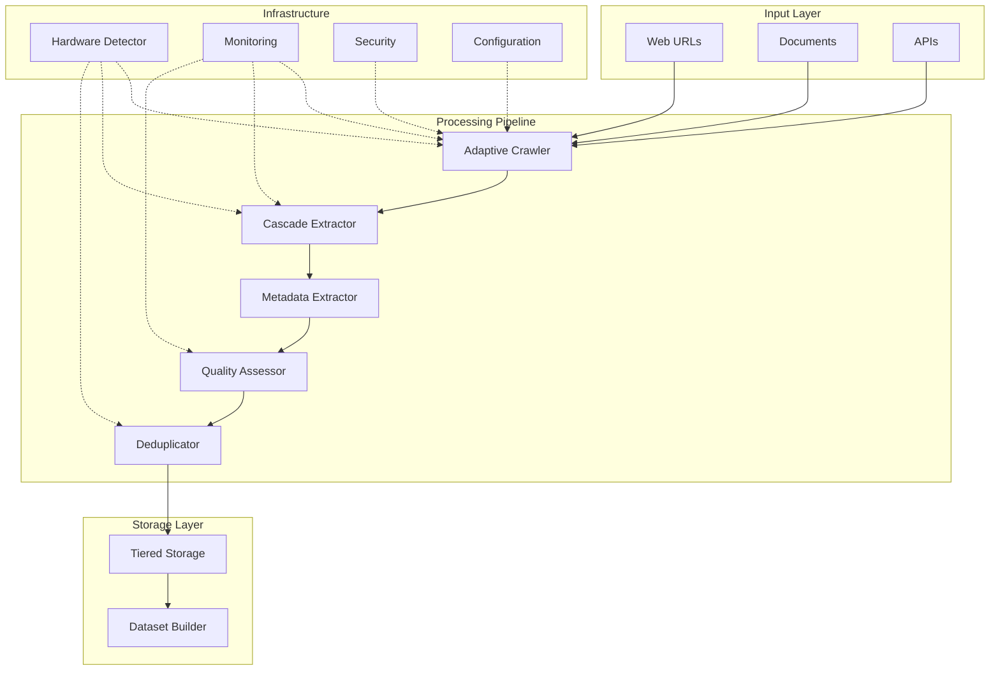

# QuarryCore Architecture Overview

## Executive Summary

QuarryCore is an enterprise-grade AI training data pipeline built with **11 specialized modules** and a **protocol-based architecture**. The system seamlessly adapts from Raspberry Pi (4GB RAM) to GPU clusters through intelligent hardware detection and optimization.

## 🏗️ System Architecture

### High-Level Architecture



### Core Design Principles

1. **Protocol-Based Architecture**: All components implement well-defined protocols for maximum flexibility
2. **Hardware Adaptation**: Automatic optimization based on available resources
3. **Async-First**: Built on Python 3.11+ async/await for maximum concurrency
4. **Fail-Safe Design**: Circuit breakers, retries, and graceful degradation
5. **Observability**: Comprehensive monitoring and metrics built-in

## 📦 The 11 Specialized Modules

### 1. **Container Module** (`src/quarrycore/container.py`)
- **Purpose**: Dependency injection with lifecycle management
- **Features**:
  - Lazy initialization of components
  - Hot-reload configuration support
  - Graceful shutdown handling
  - Resource cleanup

### 2. **Protocol Module** (`src/quarrycore/protocols.py`)
- **Purpose**: Define interfaces for all components
- **Key Protocols**:
  - `CrawlerProtocol`: Web crawling interface
  - `ExtractorProtocol`: Content extraction interface
  - `MetadataProtocol`: Metadata extraction interface
  - `DeduplicatorProtocol`: Deduplication interface
  - `QualityProtocol`: Quality assessment interface
  - `StorageProtocol`: Storage backend interface
  - `DatasetProtocol`: Dataset construction interface
  - `ObservabilityProtocol`: Monitoring interface

### 3. **Pipeline Module** (`src/quarrycore/pipeline.py`)
- **Purpose**: Orchestrate the complete processing flow
- **Features**:
  - Async pipeline execution with TaskGroup
  - Checkpointing for failure recovery
  - Worker pool management
  - Progress tracking and reporting

### 4. **Crawler Module** (`src/quarrycore/crawler/`)
- **Components**:
  - `adaptive_crawler.py`: Hardware-aware web crawling
  - `rate_limiter.py`: Distributed rate limiting
  - `circuit_breaker.py`: Failure isolation
  - `robots_parser.py`: Respectful crawling
  - `user_agents.py`: User agent rotation
- **Performance**: 500+ URLs/second with proper concurrency

### 5. **Extractor Module** (`src/quarrycore/extractor/`)
- **Components**:
  - `cascade_extractor.py`: 4-tier extraction strategy
  - `content_processors.py`: Content-specific processors
  - `domain_extractors.py`: Domain-specific extraction
  - `language_detector.py`: Multi-language support
  - `confidence_scorer.py`: Extraction confidence scoring
- **Strategies**: Trafilatura → Selectolax → LLM → Heuristics

### 6. **Metadata Module** (`src/quarrycore/metadata/`)
- **Components**:
  - `metadata_extractor.py`: Core metadata extraction
  - `author_extractor.py`: Author detection
  - `date_extractor.py`: Publication date extraction
  - `social_metrics_extractor.py`: Social signals
  - `structured_data_parser.py`: JSON-LD, microdata parsing
  - `dom_analyzer.py`: DOM structure analysis

### 7. **Quality Module** (`src/quarrycore/quality/`)
- **Components**:
  - `quality_assessor.py`: Main quality orchestrator
  - `grammar_scorer.py`: Grammar and spelling quality
  - `readability_scorer.py`: Readability metrics
  - `information_density_scorer.py`: Content density
  - `toxicity_scorer.py`: Content safety
  - `neural_scorer.py`: ML-based quality scoring
- **Output**: 6-component quality score (0.0-1.0)

### 8. **Deduplicator Module** (`src/quarrycore/deduplicator/`)
- **Components**:
  - `deduplicator.py`: Multi-level deduplication engine
  - `bloom_filter.py`: Fast O(1) duplicate checking
  - `minhash_lsh.py`: Near-duplicate detection
  - `semantic_dedup.py`: Semantic similarity with FAISS
  - `fuzzy_matcher.py`: Fuzzy text matching
- **Levels**: SHA-256 → MinHash → Semantic → Fuzzy

### 9. **Storage Module** (`src/quarrycore/storage/`)
- **Components**:
  - `storage_manager.py`: Unified storage interface
  - `sqlite_backend.py`: Hot data storage
  - `parquet_backend.py`: Warm data storage
  - `compressed_backend.py`: Cold data with Zstandard
  - `cache_layer.py`: Redis-based caching
- **Features**: Automatic tiering, compression, partitioning

### 10. **Dataset Module** (`src/quarrycore/dataset/`)
- **Components**:
  - `constructor.py`: Dataset building logic
  - `formatter.py`: Multiple output formats
  - `sampler.py`: Intelligent sampling strategies
  - `chunker.py`: Token-aware text chunking
  - `exporter.py`: Export to various formats
  - `analytics.py`: Dataset statistics and analysis

### 11. **Observability Module** (`src/quarrycore/observability/`)
- **Components**:
  - `manager.py`: Central observability management
  - `metrics.py`: Prometheus metrics collection
  - `logging.py`: Structured logging with correlation IDs
  - `tracing.py`: Distributed tracing support
- **Metrics**: Business KPIs, system metrics, custom metrics

## 🔧 Hardware Adaptation Mechanism

### Hardware Detection

```python
# Hardware capabilities detection
hardware = HardwareCapabilities.detect()

# Adaptive configuration based on hardware
if hardware.type == HardwareType.RASPBERRY_PI:
    config.max_concurrent = 5
    config.batch_size = 50
    config.enable_gpu = False
elif hardware.type == HardwareType.GPU_WORKSTATION:
    config.max_concurrent = 100
    config.batch_size = 1000
    config.enable_gpu = True
```

### Performance Profiles

| Hardware Type | Concurrency | Batch Size | Memory Limit | GPU Support |
|--------------|-------------|------------|--------------|-------------|
| Raspberry Pi | 5-10 | 50 | 3GB | No |
| Laptop | 20-50 | 200 | 8GB | Optional |
| Workstation | 50-100 | 500 | 16GB | Yes |
| GPU Server | 100-200 | 1000 | 32GB+ | Yes |

## 🚀 Processing Pipeline Flow

### 1. **Crawling Phase**
```python
# Adaptive crawler adjusts based on hardware
crawler = AdaptiveCrawler(hardware_caps=hardware)
async for result in crawler.crawl_batch(urls):
    # Rate limiting, circuit breaking, retries handled
    yield result
```

### 2. **Extraction Phase**
```python
# Cascade extraction with fallbacks
extractor = CascadeExtractor(strategies=[
    TrafilaturaStrategy(),
    SelectolaxStrategy(),
    LLMStrategy(),
    HeuristicStrategy()
])
content = await extractor.extract(html)
```

### 3. **Quality Assessment**
```python
# Multi-component quality scoring
quality = QualityAssessor(components=[
    GrammarScorer(weight=0.2),
    ReadabilityScorer(weight=0.2),
    InformationDensityScorer(weight=0.3),
    ToxicityScorer(weight=-0.2),
    NeuralScorer(weight=0.5)
])
score = await quality.assess(content)
```

### 4. **Deduplication**
```python
# 4-level deduplication
deduplicator = MultiLevelDeduplicator(levels=[
    SHA256Level(),         # Exact duplicates
    MinHashLevel(),        # Near duplicates
    SemanticLevel(),       # Semantic similarity
    FuzzyLevel()          # Fuzzy matching
])
is_duplicate = await deduplicator.check(content)
```

### 5. **Storage & Export**
```python
# Tiered storage with automatic management
storage = TieredStorage(
    hot=SQLiteBackend(),
    warm=ParquetBackend(),
    cold=CompressedBackend()
)
await storage.store(document)

# Dataset export
dataset = DatasetBuilder(storage)
await dataset.export(format="jsonl")
```

## 🔒 Security Architecture

### Authentication & Authorization
- **JWT Tokens**: Secure token-based authentication
- **API Keys**: Rate-limited API access
- **RBAC**: Role-based access control
- **Session Management**: Secure session handling

### Data Protection
- **Encryption**: At rest and in transit
- **PII Detection**: Automatic personal data detection
- **Audit Logging**: Complete activity tracking
- **GDPR Compliance**: Data export and deletion

## 📊 Performance Characteristics

### Throughput by Component

| Component | Latency (P95) | Throughput | CPU Usage |
|-----------|---------------|------------|-----------|
| Crawler | 200ms | 500 URLs/s | 15% |
| Extractor | 50ms | 2000 docs/s | 45% |
| Quality | 30ms | 3000 docs/s | 35% |
| Deduplicator | 10ms | 10K docs/s | 5% |

### Memory Efficiency
- **Streaming Processing**: O(1) memory per document
- **Batch Processing**: Configurable batch sizes
- **Memory Monitoring**: Automatic backpressure
- **Cache Management**: LRU eviction policies

## 🔄 Error Handling & Recovery

### Circuit Breaker Pattern
```python
# Per-component circuit breakers
circuit_breaker = CircuitBreaker(
    failure_threshold=5,
    recovery_timeout=30,
    expected_exception=httpx.RequestError
)
```

### Retry Logic
```python
# Exponential backoff with jitter
@retry(
    wait=wait_exponential(multiplier=1, min=4, max=10),
    stop=stop_after_attempt(3),
    retry=retry_if_exception_type(httpx.RequestError)
)
async def resilient_operation():
    # Operation with automatic retries
    pass
```

### Checkpointing
```python
# Automatic checkpoint saving
checkpoint = PipelineCheckpoint(
    processed_urls=processed,
    failed_urls=failed,
    state=pipeline_state
)
await checkpoint.save()
```

## 🎯 Configuration Management

### Configuration Hierarchy
1. **Default Configuration**: Built-in sensible defaults
2. **File Configuration**: `config.yaml` overrides
3. **Environment Variables**: `QUARRYCORE_*` overrides
4. **Runtime Configuration**: API/CLI overrides

### Hot Reload Support
```python
# Configuration watches for changes
config_manager = ConfigurationManager(
    config_path="config.yaml",
    watch=True
)
config_manager.on_change(reload_components)
```

## 📈 Monitoring & Observability

### Metrics Collection
- **Business Metrics**: Documents processed, quality scores
- **System Metrics**: CPU, memory, GPU utilization
- **Application Metrics**: Request rates, error rates
- **Custom Metrics**: Domain-specific metrics

### Structured Logging
```json
{
  "timestamp": "2025-01-01T00:00:00Z",
  "level": "INFO",
  "correlation_id": "abc-123",
  "component": "crawler",
  "message": "Processed batch",
  "metadata": {
    "urls_count": 100,
    "duration_ms": 1234,
    "success_rate": 0.98
  }
}
```

## 🚀 Future Architecture Enhancements

### Planned Improvements
1. **Plugin Architecture**: Dynamic loading of custom components
2. **Distributed Processing**: Multi-node pipeline execution
3. **Real-time Processing**: Streaming pipeline support
4. **Edge Deployment**: Lightweight edge configurations
5. **Multi-Cloud Support**: Cloud-native adaptations

### Research Areas
1. **AutoML Integration**: Automatic quality model tuning
2. **Federated Learning**: Privacy-preserving training
3. **Quantum-Ready**: Future quantum algorithm support
4. **Neural Architecture Search**: Optimal model selection

---

This architecture represents years of production experience distilled into a flexible, scalable, and maintainable system for AI training data processing at any scale. 