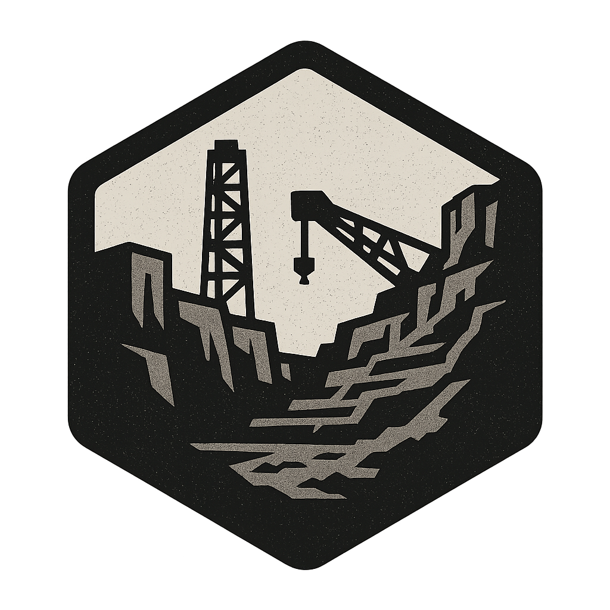
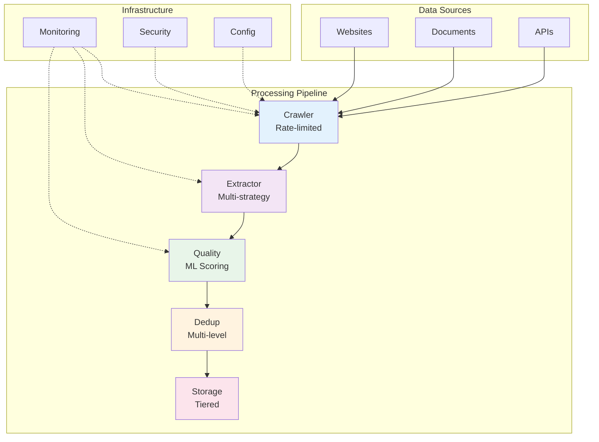

<div align="center">



# QuarryCore

### Enterprise-Grade AI Training Data Pipeline

[](https://www.python.org)
[](LICENSE)
[](https://github.com/shua-ie/quarrycore/actions)
[](https://codecov.io/gh/shua-ie/quarrycore)

**Transform raw web content into high-quality AI training datasets with production-grade reliability**

<p align="center">
  <a href="#-quick-start">Quick Start</a> •
  <a href="#-features">Features</a> •
  <a href="#-documentation">Documentation</a> •
  <a href="#-architecture">Architecture</a> •
  <a href="#-enterprise">Enterprise</a>
</p>

</div>

---

## 🚀 Why QuarryCore?

QuarryCore is a **production-grade data pipeline** that transforms raw web content into high-quality AI training datasets. Built with **modular architecture** and **protocol-based design**, it seamlessly adapts from Raspberry Pi (4GB RAM) to enterprise GPU clusters.

### 🎯 Key Benefits

- 🏗️ **Hardware Adaptive** - Automatically optimizes performance from Pi to GPU workstations
- 🧠 **Intelligent Processing** - Multi-strategy extraction with ML-powered quality assessment
- 🔒 **Enterprise Ready** - JWT auth, rate limiting, audit logging, and monitoring built-in
- 🚀 **Developer Friendly** - Clean APIs, comprehensive docs, and extensible architecture

```python
# Extract and process web content in 3 lines
from quarrycore import Pipeline

async with Pipeline() as pipeline:
    result = await pipeline.run(["https://example.com"])
    print(f"✅ Processed {result['processed_count']} documents")
```

---

## ⚡ Quick Start

### Installation

```bash
# Clone the repository
git clone https://github.com/shua-ie/quarrycore
cd quarrycore

# Install in development mode
pip install -e .

# With GPU acceleration
pip install -e ".[gpu]"

# With all development tools
pip install -e ".[dev]"
```

### Your First Dataset (60 seconds)

```python
import asyncio
from quarrycore import Pipeline, Config
from quarrycore.container import DependencyContainer

async def create_dataset():
    # Create configuration
    config = Config()
    config.quality.default.min_overall_score = 0.8  # Only high-quality content
    
    # Create container with configuration
    container = DependencyContainer()
    
    # Create and run pipeline
    pipeline = Pipeline(container)
    
    # Process URLs
    urls = ["https://example.com"]
    result = await pipeline.run(urls)
    
    # Display results
    print(f"✅ Processed {result['processed_count']} documents")
    print(f"⏱️  Duration: {result.get('duration', 0):.2f} seconds")

# Run it
asyncio.run(create_dataset())
```

### Environment Configuration

QuarryCore supports configuration via environment variables for production deployments:

```bash
# Pipeline checkpointing (AC-06)
export CHECKPOINT_INTERVAL=60.0          # Checkpoint save interval (seconds)
export CHECKPOINT_DIR=/app/checkpoints   # Checkpoint storage directory

# Domain failure backpressure
export DOMAIN_FAILURE_THRESHOLD=5        # Max failures per domain before backoff
export DOMAIN_FAILURE_WINDOW=60.0        # Failure tracking window (seconds)
export DOMAIN_BACKOFF_DURATION=120.0     # Backoff duration (seconds)

# Dead letter queue
export DEAD_LETTER_DB_PATH=/app/dead_letter.db  # Failed URL storage

# Run with environment configuration
python -m quarrycore.cli process urls.txt
```
```

---

## 🎨 Features

### Currently Available

| Feature | Description | Status |
|---------|-------------|---------|
| 🔄 **Multi-Strategy Extraction** | Cascade extraction with multiple fallback strategies | ✅ Available |
| ⚡ **Hardware Adaptation** | Auto-optimization from Pi to GPU clusters | ✅ Available |
| 🔍 **Multi-Level Deduplication** | Hash, MinHash, semantic, and fuzzy matching | ✅ Available |
| 📊 **Quality Assessment** | ML-powered scoring with domain intelligence | ✅ Available |
| 🛡️ **Enterprise Security** | JWT auth, rate limiting, audit logging | ✅ Available |
| 🐳 **Container Deployment** | Docker files for CPU and GPU deployment | ✅ Available |
| 📈 **Prometheus Metrics** | Business KPIs and system monitoring | ✅ Available |

### Planned Enhancements

| Feature | Description | Status |
|---------|-------------|---------|
| 📊 **Grafana Dashboards** | Pre-built monitoring dashboards with alerts | 🚀 Planned |
| 📚 **Comprehensive Documentation** | Full API and architecture documentation | 🚀 Planned |
| 🔐 **Enterprise SSO** | SAML/OIDC integration | 🚀 Planned |
| 🧩 **Plugin Architecture** | Extensible extractors and processors | 🚀 Planned |
| 🌐 **Multi-Cloud Support** | AWS/GCP/Azure native integrations | 🚀 Planned |

---

## 📖 Documentation

| Resource | Description | Status |
|----------|-------------|---------|
| [🏗️ Architecture Overview](ANALYSIS_REPORT.md) | System design and component analysis | ✅ Available |
| [🚀 Deployment Guide](DEPLOYMENT.md) | Production deployment instructions | ✅ Available |
| [🔧 Configuration Guide](config.example.yaml) | Configuration options and examples | ✅ Available |
| [🔒 Security Guide](SECURITY.md) | Security best practices | ✅ Available |
| [🤝 Contributing Guide](CONTRIBUTING.md) | Developer contribution guidelines | ✅ Available |

---

## 📊 Performance Characteristics

*Performance varies based on hardware capabilities and configuration*

| Hardware | Target Throughput | Memory Usage | Notes |
|----------|-------------------|--------------|-------|
| **Raspberry Pi 4** | 50-200 docs/min | 2-4GB | CPU-only, optimized for memory |
| **MacBook Pro M2** | 200-500 docs/min | 6-8GB | Balanced performance |
| **Workstation** | 500-1000 docs/min | 8-12GB | Multi-core optimization |
| **GPU Server** | 1000+ docs/min | 12-16GB | GPU acceleration for ML tasks |

<details>
<summary><b>Performance Optimization Tips</b></summary>

### Hardware Adaptation
The system automatically detects hardware capabilities and adjusts:
- **Concurrency levels** based on CPU cores
- **Batch sizes** based on available memory
- **GPU utilization** for ML-powered quality assessment
- **Storage strategy** based on disk type

### Configuration Tuning
```yaml
# config.yaml - Optimize for your use case
crawler:
  max_concurrent_requests: 50  # Adjust based on network
  
quality:
  default:
    min_overall_score: 0.7    # Balance quality vs quantity
    
dataset:
  chunking:
    chunk_size: 2048          # Adjust based on memory
```

</details>

---

## 🏢 Enterprise Features

### Security & Compliance

- 🔐 **Authentication** - JWT tokens with refresh, API keys, RBAC
- 🛡️ **Rate Limiting** - Redis-backed distributed enforcement
- 📝 **Audit Logging** - Complete activity tracking with correlation IDs
- 🔒 **Data Security** - Input validation and secure processing
- 📊 **Monitoring Ready** - Prometheus metrics and health checks

### Monitoring & Operations

<table>
<tr>
<td width="50%">

**Current Capabilities**
- ✅ Prometheus metrics export
- ✅ Health check endpoints
- ✅ Structured JSON logging
- ✅ Performance profiling
- ✅ Resource monitoring

</td>
<td width="50%">

**Planned Enhancements**
- 🚀 Grafana dashboard templates
- 🚀 Distributed tracing (Jaeger)
- 🚀 Advanced alerting rules
- 🚀 SLA monitoring
- 🚀 Cost analytics

</td>
</tr>
</table>

### Deployment Options

```yaml
# Docker deployment
docker build -f docker/Dockerfile.cpu -t quarrycore:cpu .
docker run -p 8000:8000 quarrycore:cpu

# Kubernetes deployment
kubectl apply -f k8s/production/
```

---

## 💡 Use Cases

### Web Content Processing
```python
from quarrycore import Pipeline, Config
from quarrycore.container import DependencyContainer

# Configure for web scraping
config = Config()
config.crawler.rate_limiter.max_requests = 10  # Respectful crawling
config.quality.default.min_overall_score = 0.8

# Create pipeline
container = DependencyContainer()
pipeline = Pipeline(container)

# Process URLs
urls = ["https://example.com/blog", "https://example.com/docs"]
result = await pipeline.run(urls)

print(f"Processed {result['processed_count']} documents")
```

### Batch Processing Configuration
```python
# Configure for batch processing
config = Config()
config.crawler.max_concurrent_requests = 50
config.deduplication.enabled_levels = [1, 2, 3]  # Enable all dedup levels
config.storage.hot.pool_size = 20  # Increase connection pool

# Process with custom configuration
container = DependencyContainer(config_path="config.yaml")
pipeline = Pipeline(container, max_concurrency=100)
```

---

## 🏗️ Architecture

<details>
<summary><b>View System Architecture</b></summary>



### Key Components

| Module | Purpose | Implementation |
|--------|---------|----------------|
| **Container** | Dependency injection with hot-reload | [`src/quarrycore/container.py`](src/quarrycore/container.py) |
| **Pipeline** | Orchestration with checkpointing | [`src/quarrycore/pipeline.py`](src/quarrycore/pipeline.py) |
| **Crawler** | Adaptive web crawling | [`src/quarrycore/crawler/`](src/quarrycore/crawler/) |
| **Extractor** | Multi-strategy content extraction | [`src/quarrycore/extractor/`](src/quarrycore/extractor/) |
| **Quality** | ML-powered assessment | [`src/quarrycore/quality/`](src/quarrycore/quality/) |
| **Deduplicator** | Multi-level deduplication | [`src/quarrycore/deduplicator/`](src/quarrycore/deduplicator/) |
| **Storage** | Tiered storage system | [`src/quarrycore/storage/`](src/quarrycore/storage/) |
| **Security** | Authentication and rate limiting | [`src/quarrycore/security/`](src/quarrycore/security/) |

</details>

---

## 🤝 Community & Support

### Getting Help

| Channel | Response Time | Best For |
|---------|---------------|----------|
| [GitHub Issues](https://github.com/shua-ie/quarrycore/issues) | 24-48 hours | Bug reports, features |
| [Discussions](https://github.com/shua-ie/quarrycore/discussions) | 2-3 days | Questions, ideas |

### Contributing

We welcome contributions! See our [Contributing Guide](CONTRIBUTING.md) for details.

```bash
# Get started with development
git clone https://github.com/shua-ie/quarrycore
cd quarrycore
pip install -e ".[dev]"

# Run tests
pytest tests/ -v

# Check code quality
mypy src/
black src/
ruff check src/
```

---

## 📊 Project Stats

<div align="center">

[](https://github.com/shua-ie/quarrycore/stargazers)
[](https://github.com/shua-ie/quarrycore/network/members)
[](https://github.com/shua-ie/quarrycore/graphs/contributors)
[](https://github.com/shua-ie/quarrycore/issues)

</div>

### Code Quality

| Metric | Status | Details |
|--------|--------|---------|
| **Type Safety** |  | 100% typed |
| **Test Coverage** |  | Comprehensive test suite |
| **Code Quality** |  | Zero issues |
| **Security** | Security-first design | Regular audits |

---

## 📜 License

MIT License - see [LICENSE](LICENSE) for details.

---

<div align="center">

<h3>Built with ❤️ by engineers who needed better AI training data</h3>

<p>
  <a href="https://github.com/shua-ie/quarrycore/stargazers">⭐ Star us on GitHub</a> •
  <a href="https://github.com/shua-ie/quarrycore/issues">💡 Request a Feature</a> •
  <a href="CONTRIBUTING.md">🤝 Contribute</a>
</p>

<sub>If QuarryCore helps your project, please star this repository!</sub>

</div> 