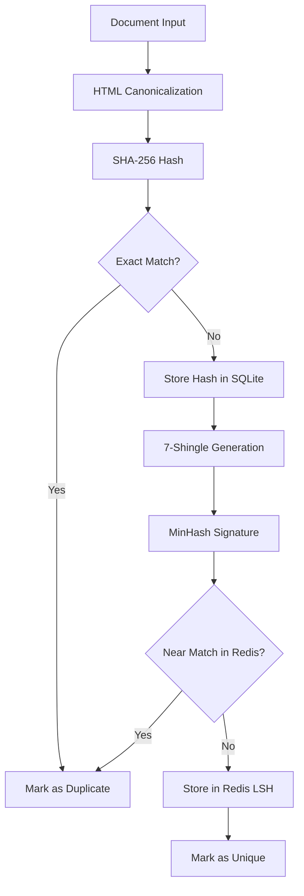

# Hybrid Deduplication System

QuarryCore implements a production-grade, two-layer deduplication system designed for high-throughput web content processing with sub-2ms median latency.

## Architecture Overview

The hybrid deduplication system combines two complementary approaches:

1. **Exact Layer**: Canonical HTML → SHA-256 → SQLite WAL storage
2. **Near Layer**: MinHashLSH (datasketch) → Redis backend



## Key Features

- **Fast Exact Detection**: Immediate return on exact duplicates (< 1ms)
- **Near-Duplicate Detection**: 7-character shingles with 85% similarity threshold
- **Resilient Operation**: Graceful degradation when Redis unavailable
- **Prometheus Metrics**: Real-time monitoring and alerting
- **WAL SQLite**: High-concurrency exact hash storage
- **Canonical HTML**: Consistent hashing across equivalent content

## Configuration

### Environment Variables

The deduplication system supports environment variable overrides with the `QUARRY_DEDUP_*` prefix:

```bash
# SQLite exact hash layer
QUARRY_DEDUP_HYBRID_SQLITE_PATH="data/dedup.db"

# Redis MinHashLSH layer  
QUARRY_DEDUP_HYBRID_REDIS_URL="redis://localhost:6379/0"

# MinHash configuration
QUARRY_DEDUP_HYBRID_MINHASH_SHINGLE_SIZE=7
QUARRY_DEDUP_HYBRID_MINHASH_NUM_PERM=128
QUARRY_DEDUP_HYBRID_MINHASH_THRESHOLD=0.85
QUARRY_DEDUP_HYBRID_MINHASH_ENABLED=true
```

### YAML Configuration

```yaml
dedup:
  hybrid:
    sqlite_path: "data/dedup.db"
    redis_url: "redis://localhost:6379/0"
    minhash:
      shingle_size: 7
      num_perm: 128
      threshold: 0.85
      enabled: true
```

### Configuration Reference

| Parameter | Default | Description |
|-----------|---------|-------------|
| `sqlite_path` | `data/dedup.db` | SQLite database path for exact hash storage |
| `redis_url` | `redis://localhost:6379/0` | Redis URL for MinHashLSH backend |
| `minhash_shingle_size` | `7` | Character shingle size for MinHash |
| `minhash_num_perm` | `128` | Number of permutations for MinHash |
| `minhash_threshold` | `0.85` | Jaccard similarity threshold (0.0-1.0) |
| `minhash_enabled` | `true` | Enable/disable near-duplicate detection |

## Database Schema

### SQLite Exact Hash Table

```sql
CREATE TABLE hash_dedup (
    hash TEXT PRIMARY KEY,
    url TEXT NOT NULL,
    timestamp REAL NOT NULL,
    created_at DATETIME DEFAULT CURRENT_TIMESTAMP
);

CREATE INDEX idx_hash_dedup_timestamp ON hash_dedup(timestamp);
CREATE INDEX idx_hash_dedup_url ON hash_dedup(url);
```

### Redis Keys

The MinHashLSH system uses Redis keys with the `lsh:*` prefix:

- `lsh:b:{band_id}:{band_hash}` - LSH band buckets
- `lsh:sig:{doc_id}` - MinHash signatures
- `lsh:meta` - Index metadata

## API Reference

### Simple Boolean API

```python
from quarrycore.dedup.hybrid_dedup import HybridDeduplicator, DedupConfig, ExtractResult

# Initialize deduplicator
config = DedupConfig()
deduplicator = HybridDeduplicator(config)

# Check for duplicates
doc = ExtractResult(
    text="Document content",
    html="<html>...</html>", 
    url="https://example.com"
)

is_duplicate = await deduplicator.is_duplicate(doc)
print(f"Document is duplicate: {is_duplicate}")
```

### Legacy Compatibility

For existing codebases using the rich DuplicationResult API:

```python
from quarrycore.dedup.hybrid_dedup import check_duplicates_legacy

# Use with existing ExtractedContent and ContentMetadata
result = await check_duplicates_legacy(deduplicator, content, metadata)
print(f"Is duplicate: {result.is_duplicate}")
print(f"Processing time: {result.processing_time_ms}ms")
```

## HTML Canonicalization

The exact layer uses deterministic HTML canonicalization to ensure consistent hashing:

### Transformations Applied

1. **Script/Style Removal**: Complete removal of `<script>` and `<style>` tags and content
2. **Whitespace Normalization**: Collapse multiple spaces/newlines to single space
3. **Entity Decoding**: Convert common HTML entities (`&amp;`, `&lt;`, etc.)
4. **Tag Stripping**: Remove all HTML tags, keeping only text content
5. **Trim**: Remove leading and trailing whitespace

### Example

```html
<!-- Input -->
<html>
    <head>
        <title>Test &amp; Example</title>
        <script>alert('remove me');</script>
        <style>body { color: red; }</style>
    </head>
    <body>
        <h1>Hello    World</h1>
        <p>Content   here</p>
    </body>
</html>

<!-- Canonical Output -->
Test & Example Hello World Content here
```

## Performance Characteristics

### Latency Targets

- **Exact Duplicates**: < 1ms (immediate SQLite lookup)
- **Near Duplicates**: < 2ms (MinHash + Redis LSH)
- **Overall Median**: ≤ 2ms (99th percentile target)

### Throughput

- **Exact Layer**: 10,000+ documents/second (SQLite WAL)
- **Near Layer**: 5,000+ documents/second (Redis-limited)
- **Combined**: 5,000+ documents/second

### Memory Usage

- **Canonical Processor**: ~10MB baseline
- **SQLite**: ~40MB cache (configurable)
- **Redis**: Depends on document volume (~1KB per document)

## Monitoring and Metrics

### Prometheus Metrics

```prometheus
# Exact duplicate hits
dedup_exact_hits_total

# Near duplicate hits  
dedup_near_hits_total

# Processing latency by layer
dedup_latency_seconds{layer="exact|near|total"}
```

### Example Queries

```promql
# Duplicate detection rate
rate(dedup_exact_hits_total[5m]) + rate(dedup_near_hits_total[5m])

# 95th percentile latency
histogram_quantile(0.95, rate(dedup_latency_seconds_bucket[5m]))

# Error rate
rate(dedup_errors_total[5m])
```

### Logs

The system uses structured logging with JSON output:

```json
{
  "timestamp": "2024-01-15T10:30:00Z",
  "level": "info",
  "event": "exact_duplicate_detected",
  "url": "https://example.com/page",
  "duration_ms": 0.8,
  "hash": "a1b2c3d4..."
}
```

## Deployment

### Redis Requirements

- **Version**: Redis 5.0+ (supports streams)
- **Memory**: Plan for ~1KB per unique document
- **Persistence**: RDB snapshots recommended for LSH recovery
- **Networking**: Low latency connection to application

### SQLite Configuration

```sql
-- Production SQLite pragmas (applied automatically)
PRAGMA journal_mode=WAL;        -- Write-Ahead Logging
PRAGMA synchronous=NORMAL;      -- Safe with WAL
PRAGMA cache_size=10000;        -- 40MB cache
PRAGMA temp_store=MEMORY;       -- In-memory temp tables
```

### High Availability

1. **Redis Fallback**: Uses `fakeredis` when Redis unavailable
2. **SQLite WAL**: Concurrent readers during writes
3. **Circuit Breakers**: Automatic failure detection and recovery
4. **Graceful Degradation**: Pipeline continues with reduced functionality

## Troubleshooting

### Common Issues

#### Redis Connection Failures

```bash
# Check Redis connectivity
redis-cli -u redis://localhost:6379/0 ping

# Monitor Redis logs
tail -f /var/log/redis/redis-server.log
```

**Solution**: The system automatically falls back to `fakeredis` and logs warnings once per minute.

#### SQLite Lock Errors

```
sqlite3.OperationalError: database is locked
```

**Solution**: Ensure WAL mode is enabled and no long-running transactions block writers.

#### High Memory Usage

Monitor Redis memory with:

```bash
redis-cli info memory
```

**Solution**: Implement TTL on LSH keys or periodic cleanup of old entries.

### Performance Tuning

#### SQLite Optimization

```python
# Adjust cache size for available memory
config = DedupConfig(sqlite_path="data/dedup.db")
# Cache size set automatically based on available memory
```

#### Redis Optimization

```bash
# Redis configuration
maxmemory 2gb
maxmemory-policy allkeys-lru
```

#### MinHash Tuning

```yaml
dedup:
  hybrid:
    minhash:
      # Higher threshold = fewer false positives, more duplicates missed
      threshold: 0.90  # More strict
      
      # More permutations = better accuracy, slower processing
      num_perm: 256    # More accurate
```

## Migration Guide

### From Legacy Deduplicator

The hybrid system is backward compatible with existing APIs:

```python
# Old code (still works)
from quarrycore.deduplicator import MultiLevelDeduplicator
deduplicator = MultiLevelDeduplicator(config)
result = await deduplicator.check_duplicates(content, metadata)

# New code (recommended)  
from quarrycore.dedup.hybrid_dedup import HybridDeduplicator
deduplicator = HybridDeduplicator(config)
is_duplicate = await deduplicator.is_duplicate(doc)
```

### Database Migration

If migrating from an existing system:

1. **Backup existing data**
2. **Run migration script** (optional): `scripts/migrate_dedup_v2.py`
3. **Update configuration** to use hybrid system
4. **Monitor metrics** during transition

## Testing

### Unit Tests

```bash
# Run deduplication tests
pytest tests/unit/test_canonical_html.py -v
pytest tests/unit/test_hash_db.py -v  
pytest tests/unit/test_minhash_redis.py -v
```

### Integration Tests

```bash
# End-to-end deduplication flow
pytest tests/functional/test_dedup_flow.py -v
```

### Performance Tests

```bash
# Benchmark latency requirements
pytest tests/benchmark/test_dedup_perf.py -v
```

## Security Considerations

- **Input Validation**: All HTML content is sanitized during canonicalization
- **Resource Limits**: Redis and SQLite have configurable memory/disk limits
- **Access Control**: Redis should not be exposed to public networks
- **Data Privacy**: Hashes are one-way, original content not stored in dedup layer

## Future Enhancements

- **Semantic Deduplication**: Optional GPU-accelerated embedding similarity
- **Distributed Redis**: Redis Cluster support for horizontal scaling
- **Content-Type Specific**: Different thresholds per content type
- **Adaptive Thresholds**: Machine learning-based similarity tuning 